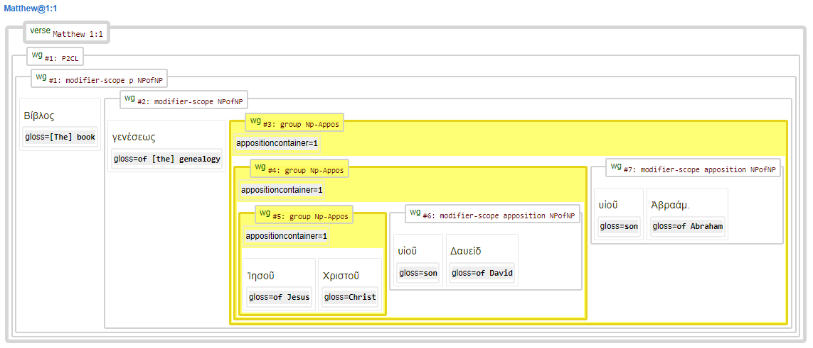

[`Transcription`](../transcription.md#start) | [`Features`](README.md#start) | [`Views`](../views.md#start) |[`Textformats`](../textformats.md#start)|  [`Syntaxtrees`](../syntaxtrees.md#start) | [`Tutorial`](../../tutorial/README.md#start) | [`Usecases`](../usecases/README.md#start) |[`About`](../about.md#start)
---  | --- | --- | --- | --- | --- | --- |---

# Nestle 1904 GNT -  Feature: appositioncontainer

Feature group | Feature type | Data type | Available for node types
---  | --- | --- | --- 
[`Syntactic`](featuresbygroup.md#syntactic-features) | [`Node`](featuresbyfeaturetype.md#node-features) | [`integer`](featuresbydatatype.md#integer-datatype) | [`wg`](featuresbynodetype.md#wordgroup-nodes) [`phrase`](featuresbynodetype.md#phrase-nodes) [`subphrase`](featuresbynodetype.md#subphrase-nodes) 

## Feature description 

This feature indicates if a wordgroup or phrase contains an apposition.

## Feature values 

For [`wg`](featuresbynodetype.md#wordgroup-nodes) nodes (used in [`wg-view`](../wg-view.md#start)):
Value | Description | Frequency
---  | --- | --- 
` ` | this entity has no appositioncontainer | -
`1` | this entity has an appositioncontainer | 1908

For [`phrase`](featuresbynodetype.md#phrase-nodes) nodes (used in [`syntax-view`](../syntactic-view.md#start)):
Value | Description | Frequency
---  | --- | --- 
` ` | this entity has no appositioncontainer | -
`1` | this entity has an appositioncontainer | 715

For [`subphrase`](featuresbynodetype.md#subphrase-nodes) nodes (used in [`syntax-view`](../syntactic-view.md#start)):
Value | Description | Frequency
---  | --- | --- 
` ` | this entity has no appositioncontainer | -
`1` | this entity has an appositioncontainer | 1908

## Note

The following image presents a nested apposition demonstrating this feature and the related feature [rela](rela.md#readme).

## Source description

Taken from (optional) XML attribute `appositioncontainer` of tag `wg` (wordgroup).

---
###### *Browse all features by [node type](featuresbynodetype.md#start), [data type](featuresbydatatype.md#start), [feature group](featuresbygroup.md#start) or [feature type](featuresbyfeaturetype.md#start).*
