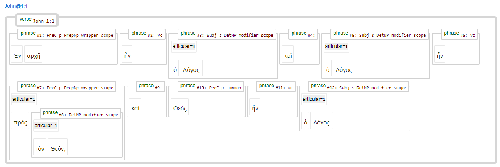

# Feature: articular 

Feature group | Feature type | Data type | Available for node types
---  | --- | --- | --- 
[`Syntactic`](featuresbygroup.md#syntactic-features) | [`Node`](featuresbyfeaturetype.md#node-features) | [`integer`](featuresbydatatype.md#integer-datatype) | [`sentence`](featuresbynodetype.md#sentence-nodes) [`group`](featuresbynodetype.md#group-nodes)  [`wg`](featuresbynodetype.md#wordgroup-nodes) [`clause`](featuresbynodetype.md#clause-nodes) [`phrase`](featuresbynodetype.md#phrase-nodes)

## Feature description 

This feature indicates if a syntact unit contains an article.

## Feature values 

value | description | Frequency
---  | --- | --- 
` ` | no articular in syntactic unit | -
`1` |  articular wg | 57544

## Notes

The following example from John 1:1 demonstrates the function of this feature.

## Source description

Taken from (optional) XML attribute `articular` of tag `wg` (wordgroup).

---
###### *Browse all features by [node type](featuresbynodetype.md#start), [data type](featuresbydatatype.md#start), [feature group](featuresbygroup.md#start) or [feature type](featuresbyfeaturetype.md#start).*
