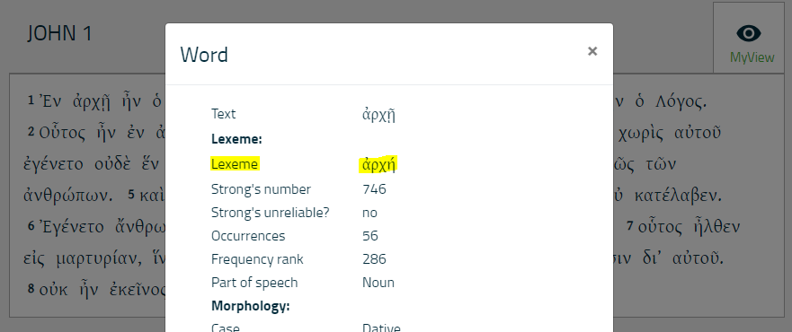

# Feature: bol_lemma 

Feature group | Feature type | Data type | Available for node types
---  | --- | --- | ---
[`Lexical`](featuresbygroup.md#lexical-features) | [`Node`](featuresbyfeaturetype.md#node-features) | [`string`](featuresbydatatype.md#string-datatype) | [`word`](featuresbynodetype.md#word-nodes) [`subphrase`](featuresbynodetype.md#subphrase-nodes) [`phrase`](featuresbynodetype.md#phrase-nodes)

## Feature description

Lexical lemma provided by [Bible Online Learner](http://www.dadel.org/). 

## Notes

This feature is essential for enhancing compatibility between the Bible Online Learner and Text-Fabric, allowing for the direct copy-paste of lemmata from BOL into TF. However, due to different usages of Unicode codepoints, such copying and pasting may not always yield the expected results when running queries in Text-Fabric. For a detailed technical explanation of this issue, see the explanatory notes on pages 33 and 34 in the [Bible Online Learner: Technical Documentation](https://github.com/EzerIT/BibleOL/blob/master/techdoc/techdoc.pdf). 

The following image shows the usage of this feature. Consider the following display of a Greek word of [John 1:1 in Bible Online Learner](http://dadel.org/text/show_text/nestle1904/John/1/1/1):

The highligted value can be copy-pasted into a TF queries like:
<pre>
   BolQuery = '''
   word bol_lemma=ἀρχή
   '''
   BolQueryResults = A.search(BolQuery)
</pre>

## Source description

External (from Bible Online Learner).

---
###### *Browse all features by [node type](featuresbynodetype.md#start), [data type](featuresbydatatype.md#start), [feature group](featuresbygroup.md#start) or [feature type](featuresbyfeaturetype.md#start).*
