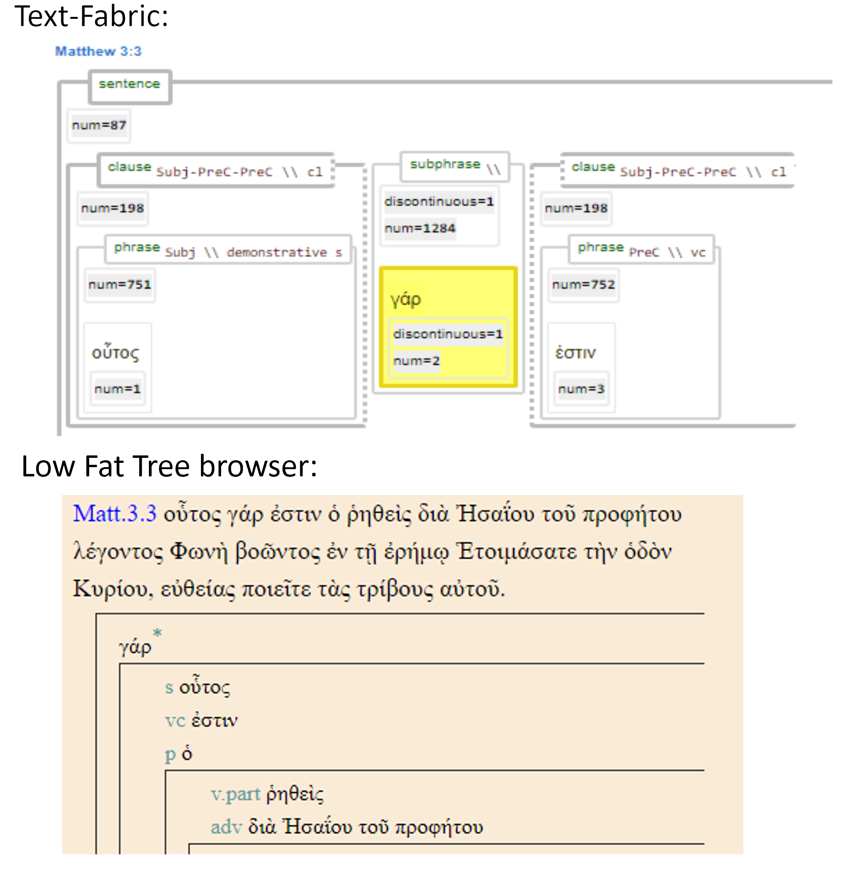

# Feature: discontinuous 

Feature group | Feature type | Data type | Available for node types
---  | --- | --- | --- 
[`Syntactic`](featuresbygroup.md#syntactic-features) | [`Node`](featuresbyfeaturetype.md#node-features) | [`string`](featuresbydatatype.md#string-datatype) | [`word`](featuresbynodetype.md#word-nodes)  [`subphrase`](featuresbynodetype.md#subphrase-nodes)  [`phrase`](featuresbynodetype.md#phrase-nodes)

## Feature description 

Set to 1 if the word is out of sequence in the XML source data in relation to the running text.  

## Feature values 

value | description | Frequency
---  | --- | --- 
` ` | no discontinuation | 
`1` |  discontinuation | 12068

## Notes

In Ancient Greek, postpositive conjunctions such as δέ and γάρ commonly occupy the second position in a clause or subclause, immediately following the first significant word. This syntactic placement not only organizes the structure of sentences but also subtly influences the meaning and rhythm of the text. Given that the source data was represented using an XML file structure, which cannot accommodate overlapping structures, these conjunctions had to be repositioned in the LowFat tree representation.

The following image compares the handling of these postpositive conjunctions in Text-Fabric and the [Low Fat Tree browser](https://ibiblio.org/bgreek/resources/syntax-trees/reader/).

## Source description

Taken from (optional) XML attribute `discontinuous` of tag `w` (word).

---
###### *Browse all features by [node type](featuresbynodetype.md#start), [data type](featuresbydatatype.md#start), [feature group](featuresbygroup.md#start) or [feature type](featuresbyfeaturetype.md#start).*
