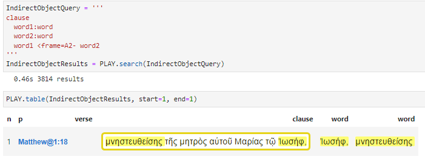
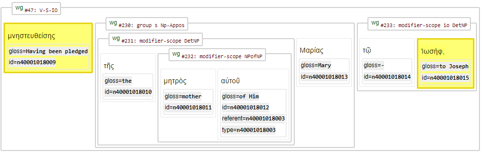

# Feature: frame  

Feature group | Feature type | Data type | Available for node types
---  | --- | --- | ---
[`Syntactic`](featuresbygroup.md#syntactic-features) | [`Edge`](featuresbyfeaturetype.md#edge-features) | [`string`](featuresbydatatype.md#string-datatype)  |  [`word`](featuresbynodetype.md#word-nodes)

## Feature description

Edge feature providing 'semantic role labeling' (SRL; Who does what to whom?) 

## Feature values:

The roles are labelled as A0, A1 or A2:

   * A0 = Agent or subject of the action.
   * A1 = Direct object or the entity directly affected by the action.
   * A2 = Indirect object or secondary entity affected by the action.

## Note

The following image shows the query that will return the node ids of the verb and the its indirect object.

The following image shows the first returned clause (from Matthew 1:18):

See also related node feature [framespec](framespec.md#start).

## Source description

Based on (optional) XML attribute `frame` of tag `w` (word).

---
###### *Browse all features by [node type](featuresbynodetype.md#start), [data type](featuresbydatatype.md#start), [feature group](featuresbygroup.md#start) or [feature type](featuresbyfeaturetype.md#start).*
