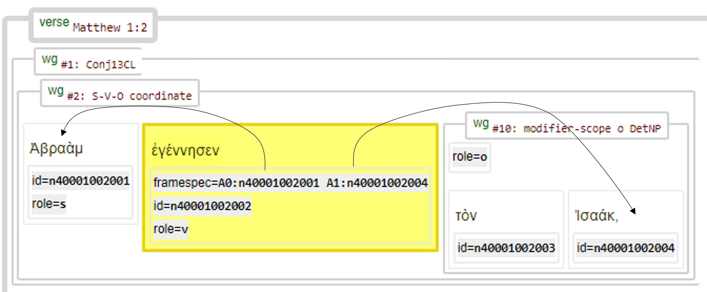
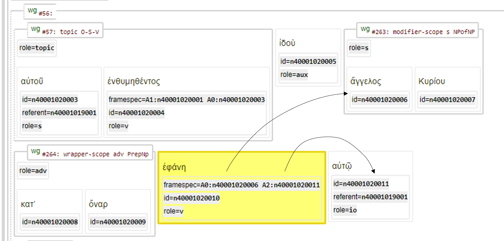

# Feature: framespec <a name="start"></a>

Feature group | Feature type | Data type | Available for node types
---  | --- | --- | ---
[`Relational`](featuresbygroup.md#relational-features) | [`Node`](featuresbyfeaturetype.md#node-features) | [`string`](featuresbydatatype.md#string-datatype) | [`word`](featuresbynodetype.md#word-nodes) [`subphrase`](featuresbynodetype.md#subphrase-nodes) [`phrase`](featuresbynodetype.md#phrase-nodes)

## Feature description

Subject reference (to [id](id.md#start)). It's functional equivalent edge feature is [frame](frame.md#start)).

## Feature values

This feature contains one or more refernces to [`id`](id.md#start)'s,  like in following example:

```
A0:n63001005005;n63001001007 A1:n63001010014
```
In this:
   * A0 = reference(s) to a subject.
   * A1 = reference(s) to an object.
   * A2 = reference(s) to the indirect object

The values behind these identifires are in the following format:

```
An 'n' followed by a 11-digit unique id in the format
    BBCCCVVVWWW
    BB          => zero-padded book, NT starts at 40
      CCC       => zero-padded chapter
         VVV    => zero-padded verse
            WWW => zero-padded word index (instance within the verse)
```

## Notes

The following syntactical graphs from Matthew 1:2 and 1:20 serve as demonstration of this feature:




See also the following related features:
   * [frame](frame.md#start): Edge feature that links nodes that are part of the frame; labelled as A0, A1 etc.
   * [id](id.md#start): id.
   * [referent](referent.md#start): referent.
   * [subjrefspec](subjrefspec.md#start): subjrefspec.

## Source description

Taken from (optional) XML attribute `frame` of tag `w` (word).

---
###### *Browse all features by [node type](featuresbynodetype.md#start), [data type](featuresbydatatype.md#start), [feature group](featuresbygroup.md#start) or [feature type](featuresbyfeaturetype.md#start).*
