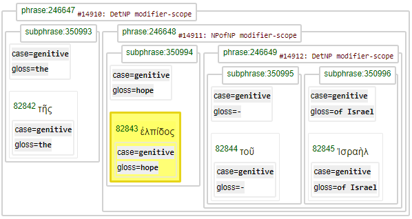
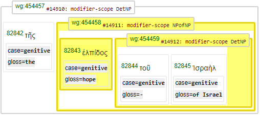
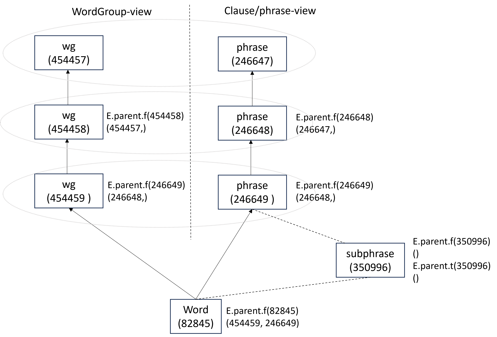

[`Transcription`](../transcription.md#start) | [`Features`](README.md#start) | [`Viewtypes`](../viewtypes.md#start) | [`Textformats`](../textformats.md#start) |  [`Syntaxtrees`](../syntaxtrees.md#start) | [`Tutorial`](../../tutorial/README.md#start) | [`Usecases`](../usecases/README.md#start) | [`About`](../about.md#start)

# Nestle 1904 GNT - Feature: parent

Feature group | Feature type | Data type | Available for node types | Used by viewtypes
---  | --- | --- | --- | ---
[`Relational`](featuresbygroup.md#relational-features) | [`Edge`](featuresbyfeaturetype.md#edge-features) | [`string`](featuresbydatatype.md#string-datatype)  | [`word`](featuresbynodetype.md#word-nodes) [`wg`](featuresbynodetype.md#wordgroup-nodes) [`Sentence`](featuresbynodetype.md#sentence-nodes) [`verse`](featuresbynodetype.md#verse-nodes) [`chapter`](featuresbynodetype.md#chapter-nodes) [`Book`](featuresbynodetype.md#book-nodes) [`phrase`](featuresbynodetype.md#phrase-nodes) [`subphrase`](featuresbynodetype.md#subphrase-nodes) | [`syntax-view`](../syntax-view.md#start) [`wg-view`](../wg-view.md#start)
 
## Feature description

Edge between a node and its parent node.

## Feature value

Any of the following:
   * Zero node value - node has no parent
   * One node value - node has one parent
   * Two node values - node has two parents

## Notes

Note that usualy any node would have just one parent. In our implementation however word nodes can have two parents, consequence of implementing the 'wg-view' and the 'syntax-view' within a single database.
The following query demonstrates a typical use of this feature. Here the parent feature is used twice in order to make sure wg2 is child of wg1 and w1 is child of wg1:
*note: rewrite this to be a 'syntactic view' query*
<pre>
Query = '''
wg1:wg type=modifier-scope
  w1:word lemma=ἐλπίς
  wg2:wg rule=DetNP
wg2 -parent> wg1
w1 -parent> wg1
'''
Results = A.search(Query)
 0.24s 6 results</pre>

Part of the results is shown in the following image when using the (default) [`syntax-view`](../syntax-view.md#start):

The same section is shown in the following image using the [`wg-view`](../wg-view.md#start):

The parent-child relation can be checked using the following functions using the node numbers printed above

<pre>
 E.parent.f(82843)
   (454458, 246648)
 F.otype.v(246648)
   'phrase'
 F.otype.v(454458)
   'wg'
</pre>

This output shows the word node has two parents: a `phrase` and a `wg` node. This dual parent relation is consequence of the implementation of two viewtypes:
   * [`syntax-view`](../syntax-view.md#start) (default): presents the syntax tree using linguistic terms like phrases and clauses.
   * [`wg-view`](../wg-view.md#start): presents the syntax tree in a more agnostic manner by means of word groups.

The following image shows how feature parent operates on the various node types. The node type 'subphrase' is not part of this parent-child relation schema.

Feature parent can also be used to identify the child node(s) by calling function E.parent.t(...):
<pre>
E.parent.f(246649)
  (246648,)
</pre>

See also the related feature [parent](parent.md#start).

## Source description

Calculated.

---
###### *Browse all features by [node type](featuresbynodetype.md#start), [data type](featuresbydatatype.md#start), [feature group](featuresbygroup.md#start) or [feature type](featuresbyfeaturetype.md#start).*

