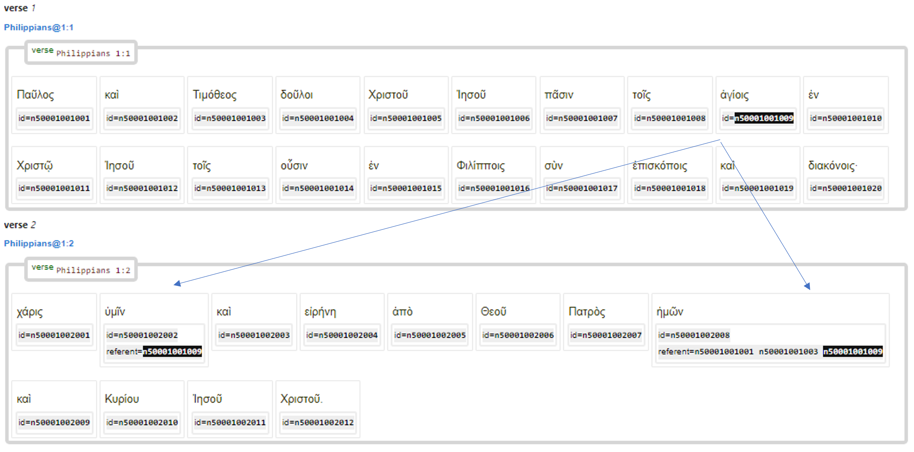

# Feature: referent <a name="start"></a>

Feature group | Feature type | Data type | Available for node types
---  | --- | --- | ---
[`Relational`](featuresbygroup.md#relational-features) | [`Node`](featuresbyfeaturetype.md#node-features)  | [`string`](featuresbydatatype.md#string-datatype)  | [`word`](featuresbynodetype.md#word-nodes)  [`subphrase`](featuresbynodetype.md#subphrase-nodes) [`phrase`](featuresbynodetype.md#phrase-nodes)

## Feature description

This feature stores information about the referent (person, item, etc) the current node is refering to. The value of referent is often crossing the boundaries of sentences and verses and is to a certain degree a discourse feature more than a syntactic.

## Feature values

The [id](id.md#start) of the referent according to following format:

```
An 'n' followed by a 11-digit unique id in the format
    BBCCCVVVWWW
    BB          => zero-padded book, NT starts at 40
      CCC       => zero-padded chapter
         VVV    => zero-padded verse
            WWW => zero-padded word index (instance within the verse)
```

## Notes

 The following image demonstrates how feature [referent](referent.md#start) links back to [id](id.md#start). In this example the ὑμῖν and ἡμῶν in  Philippians 1:2 refers back to the ἁγίοις in verse 1:



See also the following related features:
   * [framespec](framespec.md#start): framespec
   * [frame](frame.md#start): Edge feature that links nodes that are part of the frame; labelled as A0, A1 etc.
   * [id](id.md#start): id.
   * [subjrefspec](subjrefspec.md#start): subjrefspec.
 

## Source description

Taken from the optional XML tag `referent` of node `w`.

---
###### *Browse all features by [node type](featuresbynodetype.md#start), [data type](featuresbydatatype.md#start), [feature group](featuresbygroup.md#start) or [feature type](featuresbyfeaturetype.md#start).*
