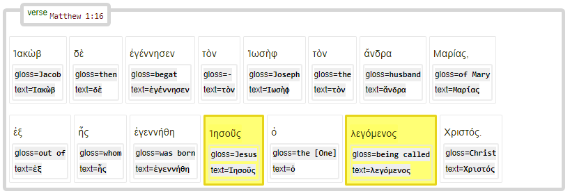

# Feature: subjref 

Feature group | Feature type | Data type | Available for node types
---  | --- | --- | ---
[`Syntactic`](featuresbygroup.md#syntactic-features) | [`Edge`](featuresbyfeaturetype.md#edge-features) | [`string`](featuresbydatatype.md#string-datatype)  | [`word`](featuresbynodetype.md#word-nodes) [`subphrase`](featuresbynodetype.md#subphrase-nodes) [`phrase`](featuresbynodetype.md#phrase-nodes)

## Feature description

Subject reference to one or more node IDs.

## Feature values

The values are formated like `n64001001002`; see also [id](id.md#start).

## Notes

The usage of this feature can be demonstrated by means of the following query:
<pre>
SubQuery = '''
clause
  w1:word 
  w2:word 
  w1 -subjref> w2
'''
SubResults = PLAY.search(SubQuery)
  0.17s 7755 results
</pre>

This will deliver results like the following:

See also related feature [subjrefspec](subjrefspec.md#start)

## Source description

Based upon (optional) XML attribute `subjref` of tag `w` (word).

---
###### *Browse all features by [node type](featuresbynodetype.md#start), [data type](featuresbydatatype.md#start), [feature group](featuresbygroup.md#start) or [feature type](featuresbyfeaturetype.md#start).*
