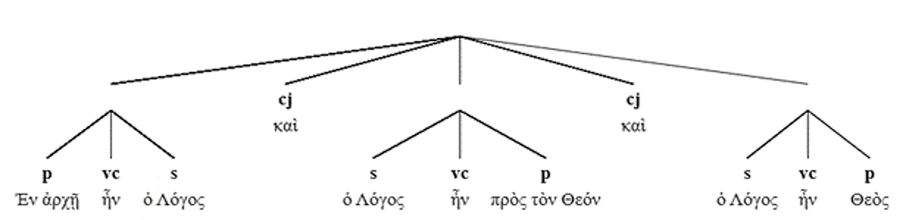

[`Transcription`](transcription.md#start) | [`Features`](features/README.md#start) | [`Viewtypes`](viewtypes.md#start) | [`Textformats`](textformats.md#start) | `Syntaxtrees`</small> | [<small>`Tutorial`](../tutorial/README.md#start) | [`Usecases`](usecases/README.md#start) |[`About`](about.md#start)

# Nestle 1904 GNT - Syntaxtrees

This Nestle 1904 Text-Fabric dataset allows for the rendering of syntax trees following a constituency grammar, which describes sentences in terms of constituent parts. These constituents are groups of words that function as a single unit (or abstraction) within a hierarchical structure. This approach emphasizes the grouping of words into phrases and how these phrases function together to create meaning. It is particularly useful for capturing nested structures like subordinate clauses. This use of constituency grammar allows also for querying complex nested sentence structures. It allows linguists, language learners, and researchers to analyzing the sentence's syntax, identifying grammatical patterns, and understanding how words function within the sentence.

The relation between the constituent parts can be depicted in a syntax tree that functions as a graphical representation of the syntactic structure. This structure is a hierarchical tree-like formation illustrating how different words in a sentence are grammatically connected to each other. In a syntax tree, each word (or morpheme) is represented as a node, and the relationships between words are depicted as branches or edges connecting these nodes. The tree starts with the main clause or the root node and branches out to represent subordinate clauses, phrases, and individual words. The tree structure reflects the hierarchical arrangement of grammatical elements within the sentence. The syntax tree provides valuable insights into the sentence's grammatical structure, including the roles of nouns, verbs, adjectives, prepositions, conjunctions, and other parts of speech. 

## Theoretic xample
The following image provides a syntax tree for the Greek text of John 1:1 based on a constituency grammar.

## This database implementations

This database has implemented two ways to display the syntaxtree. 

## Other implementations 

There are various other implementations for syntax trees, each according to their own philosophy. See [here](https://jonathanrobie.biblicalhumanities.org/blog/2017/12/20/treebanks-for-ancient-greek/) for an overview by Jonathan Robie of 'nine kinds of Ancient Greek Treebanks' describing various types of syntax-trees with special focus on the Greek New Testament. The following document describes the principles behind syntactic Treebanks for Ancient Greek: [Guidelines for the Syntactic Annotation of the
Ancient Greek Dependency Treebank (1.1)](https://vgorman.com/wp-content/uploads/2021/07/guidelines-for-Greek-2008.pdf).

