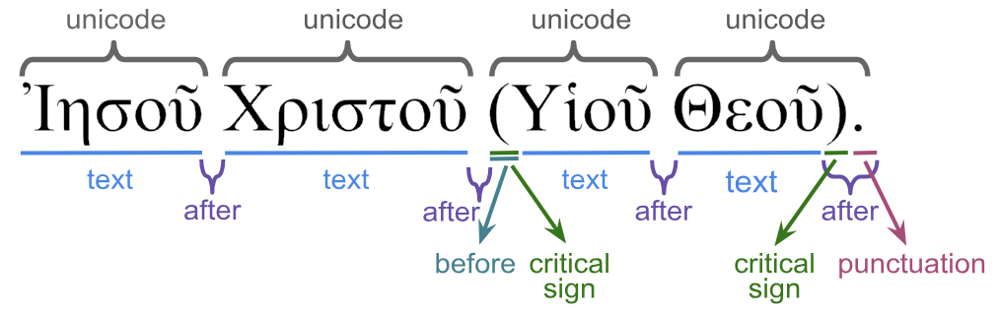

<a name="start"></a>
[`Transcription`](transcription.md#start) | [`Features`](features/README.md#start) | [`Viewtypes`](viewtypes.md#start) | `Textformats`| [`Syntaxtrees`](syntaxtrees.md#start) | [`Tutorial`](../tutorial/README.md#start) | [`Usecases`](usecases/README.md#start) |[`About`](about.md#start)

# Nestle 1904 GNT - Textformats 

Surface text related features:
   * [before](features/before.md#start): All material found before a word.
   * [criticalsign](features/criticalsign.md#start): Text-critical signs.
   * [punctuation](features/punctuation.md#start): Punctuations found after a word.
   * [text](features/text.md#start): Word without punctuations and text-critical signs.
   * [unicode](features/unicode.md#start): Unicode presentation including all material before and after word.

The following image shows the relation between these features.




The following text-formating options are defined in this dataset:
<pre>
  A.showFormats()
     format              level    template
     lex-orig-plain      word     {lemma}{punctuation}
     lex-translit-plain  word     {lextranslit}{punctuation}
     text-orig-full      word     {before}{text}{after}
     text-orig-plain     word     {text}{punctuation}
     text-translit-plain word     {translit}{punctuation}
     text-unaccent-plain word     {unaccent}{punctuation}
</pre>


## Example

This example illustrates how the different formats in this dataset affect the presentation of John 1:1.

```
# note: node 385605 is of type 'verse' and associated to John 1:1 
for formats in T.formats:
    print(f'fmt={formats}\t: {T.text(385605,formats)}')
fmt=lex-orig-plain       : ἐν ἀρχή εἰμί ὁ λόγος,καί ὁ λόγος εἰμί πρός ὁ θεός,καί θεός εἰμί ὁ λόγος.
fmt=lex-translit-plain   : en arkhe eimi o logos,kai o logos eimi pros o theos,kai theos eimi o logos.
fmt=text-orig-full       : Ἐν ἀρχῇ ἦν ὁ Λόγος,καὶ ὁ Λόγος ἦν πρὸς τὸν Θεόν,καὶ Θεὸς ἦν ὁ Λόγος.
fmt=text-orig-plain      : Ἐν ἀρχῇ ἦν ὁ Λόγος,καὶ ὁ Λόγος ἦν πρὸς τὸν Θεόν,καὶ Θεὸς ἦν ὁ Λόγος.
fmt=text-translit-plain  : En arkhe en o Logos,kai o Logos en pros ton Theon,kai Theos en o Logos.
fmt=text-unaccent-plain  : Εν αρχη ην ο Λογος,και ο Λογος ην προς τον Θεον,και Θεος ην ο Λογος.
```
