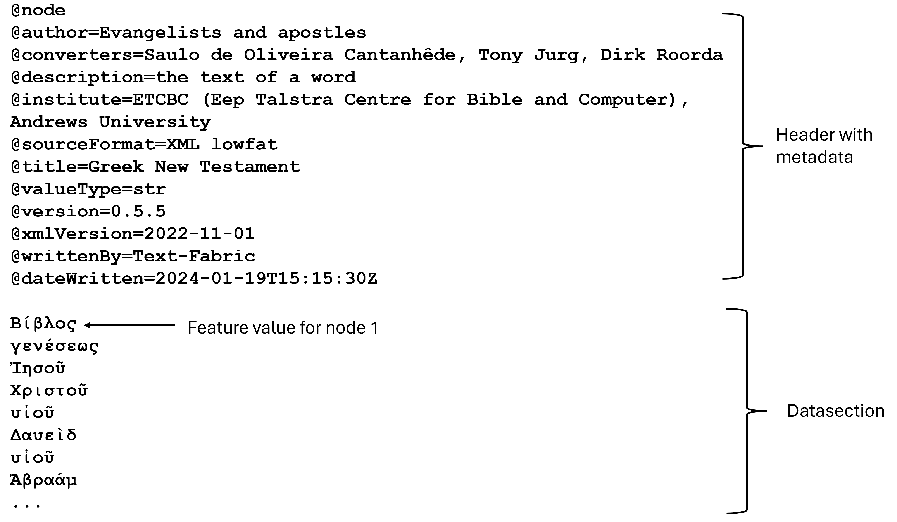

`Transcription` | [`Features`](features/README.md#start) | [`Viewtypes`](viewtypes.md#start) | [`Textformats`](textformats.md#start) | [`Syntaxtrees`](syntaxtrees.md#start) | [`Tutorial`](../tutorial/README.md#start) | [`Usecases`](usecases/README.md#start) |[`About`](about.md#start)

# Nestle 1904 GNT - Transcription

This page offers a brief overview of the transcription of the Nestle 1904 Greek New Testament (GNT) corpus, detailing how the original Greek texts is available in Text-Fabric format for digital accessibility, and outlines the types of linguistic annotations that are available.

## The database organisation

This database is organized to achieve a high level of compatibility with the [Bible Online Learner (Bible OL)](https://learner.bible/). Further in regards to nomenclature and datapresentation, it is intended to mimick the [Biblia Hebraica Stuttgartensia Amstelodamensis (BHSA)](https://etcbc.github.io/bhsa/), the ETCBC implementation of the Hebrew Bible, in terms of user experiance. These wishes have consequences for the structuring of the Text-Fabric database build up from nodes and features.

Text-Fabric, true to its name, implements the concepts of 'warp' and 'weft', inspired by textile weaving, to represent its data. The 'warp' denotes the foundational structured data, encompassing linguistic annotations like words, and phrases, while the 'weft' refers to the additional layers of information, known as features. These features encompass linguistic data, annotations, and metadata, seamlessly woven into the 'warp' data, resulting in a clear separation between structure and content. This approach enables Text-Fabric to efficiently handle complex linguistic datasets with versatility.

### Nodes and slots

In Text-Fabric, the text of a corpus is represented as a sequence of slots, which are the smallest linguistic units, implemented as 'nodes', each identified by a unique number. This database organization, often referred to as tokenization, can be based on any unit: ranging from symbols (e.g., on an Akkadian clay tablet), individual letters (e.g., from the Dead Sea Scrolls, where the text might lack letters and words, or contain unintelligible parts), to individual words. In this Text-Fabric database, tokenization is based on individual words. Therefore, this database uses 'word' nodes as its slot type, which implies that the smallest linguistic unit that can be queried is a 'word'. This approach is logical from both exegetical and linguistic perspectives, particularly since the Nestle 1904 corpus is a synthetic text without incomplete or 'missing' words due to damaged manuscripts.

### Features 

In Text-Fabric, the concept of 'feature' refers to the mapping of a node (e.g., the 'word' node) to its associated attributes with their values (e.g. in case of the 'word' node: the text itself and other details like gender, number or mood). Each node types like 'word', 'wg' (word groups), 'sentence', or 'verse' in this dataset has its own set of associated 'features' providing additional information specific to that nodetype.

Since this Text-Fabric database contains over 50 features, listings are provided based on four different types of grouping in order to provide a clear functional overview:
* [Grouped by feature group](features/featuresbygroup.md#start): e.g., [`Orthographic`](features/featuresbygroup.md#orthograpic-features), [`Syntactic`](features/featuresbygroup.md#syntactic-features).
* [Grouped by node type](features/featuresbynodetype.md#start): e.g., [`word`](features/featuresbynodetype.md#word-nodes), [`clause`](features/featuresbynodetype.md#clause-nodes).
* [Grouped by data type](features/featuresbydatatype.md#start): e.g., [`str`](features/featuresbydatatype.md#string-datatype), [`int`](features/featuresbydatatype.md#integer-datatype). The python datatype is relevant when building queries or when processing the data.
* [Grouped by feature type](features/featuresbyfeaturetype.md#start): e.g., [`node`](features/featuresbyfeaturetype.md#node-features), [`edge`](features/featuresbyfeaturetype.md#edge-features).

### Views

The concept of [viewtypes](viewtypes.md#start) is important to this dataset. This database offers the users two distinct views to represent the syntax trees:
   * [syntax-view](syntax-view.md#start) (default): present syntax tree in linguistic terms like phrases and clauses.
   * [wg-view](wg-view.md#start): present syntax tree in agnostic terms like word groups.

## Implementation note

Each Text-Fabric dataset stores all the data related to its features in a directory ['/tf/{version}'](../../tf). The data for each individual feature is storedin a plain Unicode text files with the '.tf' extention, with the filename matching the Text-Fabric feature name.  These feature  files are readable using any ordinairy text editor. Each file begins with a header section containing metadata, indicated by lines starting with the '@' symbol and followed by a blank line. This is followed by lines with feature data, where in principle the value stored on a given line 'n' is the value of that feature for node 'n'. However, Text-Fabric also contains some data optimalizations handling long sequences of empty lines, and long sequences of equal featurevalues. The following image shows the content of the .tf file for faeture 'text', which is asociated with nodetype 'word':

