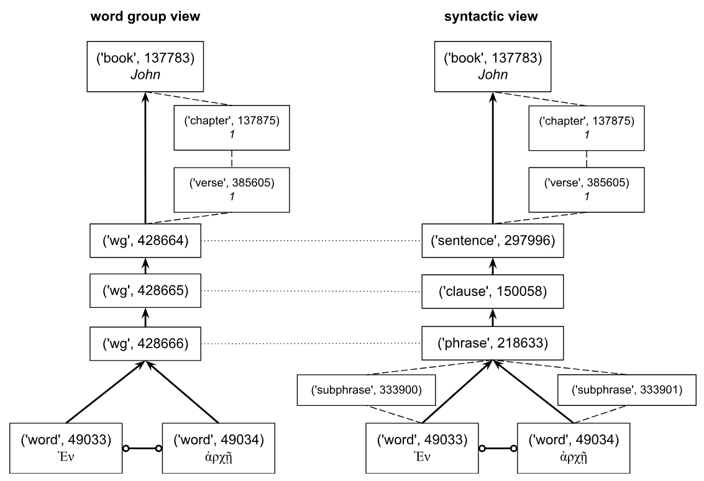

[`Transcription`](transcription.md#start) | [`Features`](features/README.md#start) | `Viewtypes` | [`Textformats`](textformats.md#start) | [`Syntaxtrees`](syntaxtrees.md#start) | [`Tutorial`](../tutorial/README.md#start) | [`Usecases`](usecases/README.md#start) |[`About`](about.md#start)

# Nestle 1904 GNT - Viewtypes

## The view types

This database offers users two distinct views to represent the syntax trees. Each viewtype has some features associated with it, using a dedicated nomenclature. The relation between node types and view types is shown in the following table.

Viewtype | Display syntax tree | Invocation | Associated node types | 
--- | --- | --- | ---
[`wg-view`](wg-view.md#start) | In agnostic terms like word groups | A.viewtype('wg') |  [`wg`](features/featuresbynodetype.md#wordgroup-nodes) 
[`syntax-view`](syntax-view.md#start) | In linguistic terms like phrases and clauses | A.viewtype('syntax') | [`subphrase`](features/featuresbynodetype.md#subphrase-nodes) [`phrase`](featuresbynodetype.md#phrase-nodes) [`clause`](features/featuresbynodetype.md#clause-nodes) [`group`](featuresbynodetype.md#group-nodes)

Note: the node types  [`Word`](features/featuresbynodetype.md#word-nodes), [`Sentence`](features/featuresbynodetype.md#sentence-nodes), [`verse`](featuresbynodetype.md#verse-nodes), [`chapter`](features/featuresbynodetype.md#chapter-nodes), and [`Book`](features/featuresbynodetype.md#book-nodes) are common for both views.

## User impact

It was found that both data designs with their repective views might have their uses, hence this Text-Fabric dataset providing both. As a result, syntactic queries can be constructed to match either one of these data structures. The following figure provides two functionaly equivalent queries:

These queries, for example, can be used to investigate what is thrown down by fire or to determine the specific preposition used for this indication. This is because we specified word class instead of lexeme. The query searches for clauses or word groups containing the verb βάλλω (meaning 'to throw down') together with a complement phrase or adverbial word group containing the lemma πῦρ (meaning 'fire'). Both queries yield identical results in terms of verses (Matthew 3:10; 7:19, Mark 9:22, and Luke 3:9) and words. However, it is also important to note that different nodes are reported for clauses and phrases compared to word groups, as evidenced by the values of each tuple's first and third item.

### Impact on using parent and sibling feature 

Understanding the distinctions between these two views is especialy important when building queries that involve parent-child relations. E.g. when using the edge features [parent](features/parent.md#start) and [sibling](features/sibling.md#start). See following image for details:

This image compares the parent (arrows) and sibling features (connector with circle) for the first phrase of the book of John (John 1:1) for the [`wg-view`](wg-view.md#start) and the [`syntax-view`](syntactic-view.md#start) for the data. The parent feature for a specific node can be obtained using *E.parent.f(node)* and the sibling feature can be calculated using *E.sibling.b(node)*, where node stands for the number of the node. The direction of the arrow indicates the parent node of a given node. The dotted lines indicate that the `wg` nodes share the same data as the [`sentence`](features/featuresbynodetype.md#sentence-nodes), [`clause`](features/featuresbynodetype.md#clause-nodes), and [`phrase`](features/featuresbynodetype.md#phrase-nodes). The [`subphrase`](features/featuresbynodetype.md#subphrase-nodes), [`verse`](features/featuresbynodetype.md#verse-nodes), and [`chapter`](features/featuresbynodetype.md#chapter-nodes) nodes are not nested in the calculation of the parent and sibling features.

## Matching table

<table>
        <tr>
            <th>wg-view</th>
            <th>syntax-view</th>
        </tr>
        <tr>
            <td>feature <a href="features/cls.md#start">cls</a></td>
            <td>feature <a href="features/typ.md#start">typ</a></td>
        </tr>
        <tr>
            <td>&nbsp;&nbsp;&nbsp;&nbsp;&nbsp;&nbsp;adjp</td>
            <td>&nbsp;&nbsp;&nbsp;&nbsp;&nbsp;&nbsp;AdjP</td>
        </tr>
        <tr>
            <td>&nbsp;&nbsp;&nbsp;&nbsp;&nbsp;&nbsp;advp</td>
            <td>&nbsp;&nbsp;&nbsp;&nbsp;&nbsp;&nbsp;AdvP</td>
        </tr>
        <tr>
            <td>&nbsp;&nbsp;&nbsp;&nbsp;&nbsp;&nbsp;np</td>
            <td>&nbsp;&nbsp;&nbsp;&nbsp;&nbsp;&nbsp;NP</td>
        </tr>
        <tr>
            <td>&nbsp;&nbsp;&nbsp;&nbsp;&nbsp;&nbsp;vp</td>
            <td>&nbsp;&nbsp;&nbsp;&nbsp;&nbsp;&nbsp;VP</td>
        </tr>
        <tr>
            <td>&nbsp;&nbsp;feature <a href="features/type.md#start">type</a></td>
            <td>&nbsp;&nbsp;feature <a href="features/typ.md#start">typ</a></td>
        </tr>
        <tr>
            <td>&nbsp;&nbsp;&nbsp;&nbsp;&nbsp;&nbsp;conjugated-wg</td>
            <td>&nbsp;&nbsp;&nbsp;&nbsp;&nbsp;&nbsp;conjuncted</td>
        </tr>
        <tr>
            <td>&nbsp;&nbsp;&nbsp;&nbsp;&nbsp;&nbsp;apposition-group</td>
            <td>&nbsp;&nbsp;&nbsp;&nbsp;&nbsp;&nbsp;apposition</td>
        </tr>
        <tr>
            <td>&nbsp;&nbsp;feature <a href="features/role.md#start">role</a></td>
            <td>&nbsp;&nbsp;feature <a href="features/function.md#start">function</a></td>
        </tr>
        <tr>
            <td>&nbsp;&nbsp;&nbsp;&nbsp;&nbsp;&nbsp;io</td>
            <td>&nbsp;&nbsp;&nbsp;&nbsp;&nbsp;&nbsp;Cmpl</td>
        </tr>
        <tr>
            <td>&nbsp;&nbsp;&nbsp;&nbsp;&nbsp;&nbsp;o</td>
            <td rowspan="2">&nbsp;&nbsp;&nbsp;&nbsp;&nbsp;&nbsp;Objc</td>
        </tr>
        <tr>
            <td>&nbsp;&nbsp;&nbsp;&nbsp;&nbsp;&nbsp;o2</td>
            <!-- merged -->
        </tr>
        <tr>
            <td>&nbsp;&nbsp;&nbsp;&nbsp;&nbsp;&nbsp;p</td>
            <td>&nbsp;&nbsp;&nbsp;&nbsp;&nbsp;&nbsp;PreC</td>
        </tr>
        <tr>
            <td>&nbsp;&nbsp;&nbsp;&nbsp;&nbsp;&nbsp;s</td>
            <td>&nbsp;&nbsp;&nbsp;&nbsp;&nbsp;&nbsp;Subj</td>
        </tr>
        <tr>
            <td>&nbsp;&nbsp;&nbsp;&nbsp;&nbsp;&nbsp;vc (for wg node)</td>
            <td rowspan="2">&nbsp;&nbsp;&nbsp;&nbsp;&nbsp;&nbsp;Pred</td>
        </tr>
        <tr>
            <td>&nbsp;&nbsp;&nbsp;&nbsp;&nbsp;&nbsp;v (for word node)</td>
            <!-- merged -->
        </tr>
        <tr>
            <td>&nbsp;&nbsp;&nbsp;&nbsp;&nbsp;&nbsp;apposition</td>
            <td>&nbsp;&nbsp;&nbsp;&nbsp;&nbsp;&nbsp;Appo</td>
        </tr>
    </table>

## Implementation notes

The implementation of this viewtype concept is done by adding a small portion of Python code to the app's [app.py](../app/app.py) file. The function of this file is to allows for functional enhancements which are required to effectively handle a corpus. The default view is defined by adding relevant parameters to the app's [config.yaml](../app/config.yaml) file.

