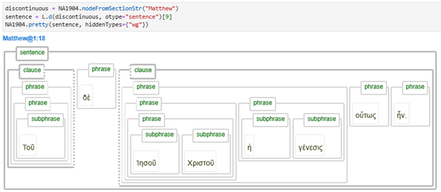
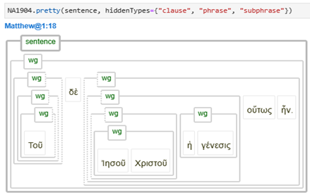

[`Transcription`](transcription.md#start) | [`Features`](features/README.md#start) | [`Views`](views.md#start) | [`Textformats`](textformats.md#start) | [`Syntaxtrees`](syntaxtrees.md#start) | [`Tutorial`](../tutorial/README.md#start) | [`Usecases`](usecases/README.md#start) |[`About`](about.md#start)
---  | --- | --- | --- | --- | --- | --- | ---

# Nestle 1904 GNT - The wg-view

*draft notes for now* 

Can be switched to when prefered.

The two views are possible since in the database there is a replication of data.

WG is an agnostic presentation. 

Swithing to a specific viewtype can be done using the command A.Viewtype(), which is specific to this dataset and automaticaly loaded upon invocation of the TF dataset.

The relation between node types and view types is shown in the following table.

View | Invocation | Associated node types | 
--- | --- | ---
`wg-view` (this view) | A.Viewtype('wg') | [`wg`](featuresbynodetype.md#wordgroup-nodes) 
[`syntax-view`](syntax-view.md#start) | A.Viewtype('syntax') | [`subphrase`](features/featuresbynodetype.md#subphrase-nodes) [`phrase`](features/featuresbynodetype.md#phrase-nodes) [`clause`](features/featuresbynodetype.md#clause-nodes) [`group`](features/featuresbynodetype.md#group-nodes)

The following images show the different presentation of the syntax tree for the two views:

### Syntax view

### Wordgroup view

